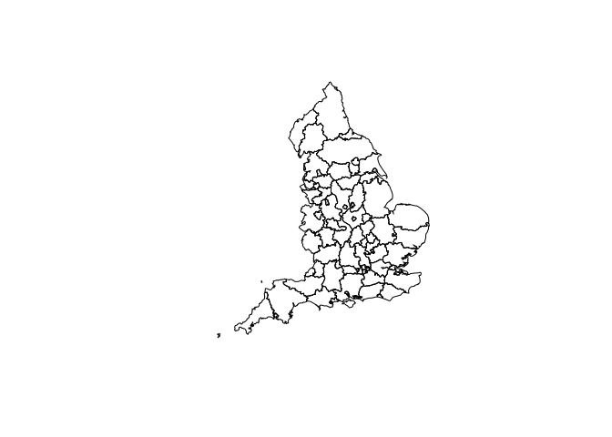

# Boundaries

This repo uses premade lookup tables to generate boundary data files
used by Active Travel England. See the `.qmd` files for reproducible
source code.

Regenerate the boundary files using the following code:

``` r
lad_to_lta_lookup = readr::read_csv("./local_authority_district_to_local_transport_authority_lookup.csv")
local_authority_geometries = sf::read_sf("https://services1.arcgis.com/ESMARspQHYMw9BZ9/arcgis/rest/services/Local_Authority_Districts_May_2023_UK_BUC_V2/FeatureServer/0/query?outFields=*&where=1%3D1&f=geojson")
local_authority_geometries_joined = dplyr::left_join(local_authority_geometries, lad_to_lta_lookup)
ltas = local_authority_geometries_joined |>
  dplyr::group_by(LTA23NM) |>
  dplyr::summarise(local_authority_names = paste0(LAD23NM, collapse = ", ")) |>
  dplyr::filter(LTA23NM != "") 
plot(ltas$geometry)
```



``` r
sf::write_sf(ltas, "./transport_authorities.geojson", delete_dsn = TRUE)
fs::file_size("./transport_authorities.geojson")
```

    399K
