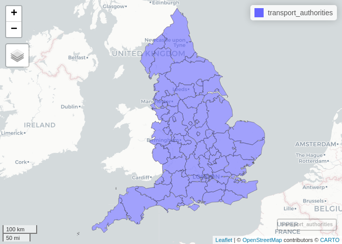

# Boundaries

This document provides reproducible code that generates boundary
datasets and lookup tables used by Active Travel England. See
`README.qmd` for reproducible source code.

## Local authority districts

Local authority districts are provided by
https://geoportal.statistics.gov.uk/. They are not static

## Transport authorities

Transport authorities are composed of one or more local authorities.

The lookup table in `lad_lookup.csv` provides a lookup between LADs and
transport authorities. The table has the following contents (sample of 9
authorities shown):

| LAD22NM               | atf4_authority_name                      |
|:----------------------|:-----------------------------------------|
| Hartlepool            | Tees Valley Combined Authority           |
| Middlesbrough         | Tees Valley Combined Authority           |
| Redcar and Cleveland  | Tees Valley Combined Authority           |
| Stockton-on-Tees      | Tees Valley Combined Authority           |
| Darlington            | Tees Valley Combined Authority           |
| Halton                | Liverpool City Region Combined Authority |
| Warrington            | Warrington                               |
| Blackburn with Darwen | Blackburn with Darwen                    |
| Blackpool             | Blackpool                                |

The lookup table was used to create a dataset representing transport
authorities, as shown below.

There are 80 transport authorities including London and Isles of Scilly.
The complete list of `atf4_authority_names` is shown below.

     [1] "Bedford"                                           
     [2] "Blackburn with Darwen"                             
     [3] "Blackpool"                                         
     [4] "Bournemouth, Christchurch and Poole"               
     [5] "Bracknell Forest"                                  
     [6] "Brighton and Hove"                                 
     [7] "Buckinghamshire"                                   
     [8] "Cambridgeshire and Peterborough Combined Authority"
     [9] "Central Bedfordshire"                              
    [10] "Cheshire East"                                     
    [11] "Cheshire West and Chester"                         
    [12] "Cornwall"                                          
    [13] "Cumbria"                                           
    [14] "Derby"                                             
    [15] "Derbyshire"                                        
    [16] "Devon"                                             
    [17] "Dorset"                                            
    [18] "East Riding of Yorkshire"                          
    [19] "East Sussex"                                       
    [20] "Essex"                                             
    [21] "Gloucestershire"                                   
    [22] "Greater Manchester Combined Authority"             
    [23] "Hampshire"                                         
    [24] "Herefordshire"                                     
    [25] "Hertfordshire"                                     
    [26] "Isle of Wight"                                     
    [27] "Kent"                                              
    [28] "Kingston upon Hull"                                
    [29] "Lancashire"                                        
    [30] "Leicester"                                         
    [31] "Leicestershire"                                    
    [32] "Lincolnshire"                                      
    [33] "Liverpool City Region Combined Authority"          
    [34] "Luton"                                             
    [35] "Medway"                                            
    [36] "Milton Keynes"                                     
    [37] "Norfolk"                                           
    [38] "North East Joint Transport Committee"              
    [39] "North East Lincolnshire"                           
    [40] "North Lincolnshire"                                
    [41] "North Northamptonshire"                            
    [42] "North Somerset"                                    
    [43] "North Yorkshire"                                   
    [44] "Nottingham"                                        
    [45] "Nottinghamshire"                                   
    [46] "Oxfordshire"                                       
    [47] "Plymouth"                                          
    [48] "Portsmouth"                                        
    [49] "Reading"                                           
    [50] "Rutland"                                           
    [51] "Shropshire"                                        
    [52] "Slough"                                            
    [53] "Somerset"                                          
    [54] "South Yorkshire Combined Authority"                
    [55] "Southampton"                                       
    [56] "Southend-on-Sea"                                   
    [57] "Staffordshire"                                     
    [58] "Stoke-on-Trent"                                    
    [59] "Suffolk"                                           
    [60] "Surrey"                                            
    [61] "Swindon"                                           
    [62] "Tees Valley Combined Authority"                    
    [63] "Telford and Wrekin"                                
    [64] "Thurrock"                                          
    [65] "Torbay"                                            
    [66] "Warrington"                                        
    [67] "Warwickshire"                                      
    [68] "West Berkshire"                                    
    [69] "West Midlands ITA"                                 
    [70] "West Northamptonshire"                             
    [71] "West Sussex"                                       
    [72] "West Yorkshire Combined Authority"                 
    [73] "West of England Combined Authority"                
    [74] "Wiltshire"                                         
    [75] "Windsor and Maidenhead"                            
    [76] "Wokingham"                                         
    [77] "Worcestershire"                                    
    [78] "York"                                              

The link between local authority districts (LADs) and transport
authorities is shown below for West Yorkshire, for example.

