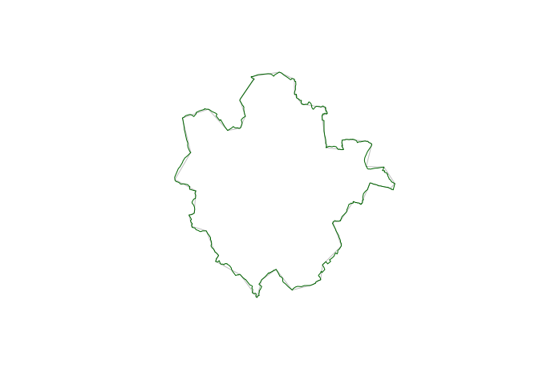

# Updating transport authority boundaries

``` r
transport_authorities_2023_09 = sf::read_sf("https://raw.githubusercontent.com/acteng/boundaries/327fd512559eef37675aa1e2906d22a43b0525e3/transport_authorities.geojson")
transport_authorities_2023_11 = sf::read_sf(here::here("../lad-lta-lookup/data/lta_2023_11.geojson"))
```

As shown below there are 81 authorities in both versions:

``` r
nrow(transport_authorities_2023_09)
```

    [1] 81

``` r
nrow(transport_authorities_2023_11)
```

    [1] 81

The column names of the authorities are as follows:

``` r
names(transport_authorities_2023_09)
```

    [1] "atf4_authority_name" "n_lads"              "lad_names"          
    [4] "geometry"           

``` r
names(transport_authorities_2023_11)
```

    [1] "LTA23NM"  "LAD23CD"  "LAD23NM"  "geometry"

Let’s check for differences in the names of the authorities:

``` r
waldo::compare(transport_authorities_2023_09[[1]], transport_authorities_2023_11[[1]])
```

    old[68:74] vs new[68:74]
      "Warrington"
      "Warwickshire"
      "West Berkshire"
    - "West Midlands ITA"
    + "West Midlands Combined Authority"
      "West Northamptonshire"
      "West Sussex"
      "West Yorkshire Combined Authority"

There’s only one difference: West Midlands ITA becomes more sensibly and
accurately West Midlands Combined Authority.

Let’s check for differences in the boundaries. We can do that by
plotting the first boundary, for example:

``` r
plot(transport_authorities_2023_09[1,0], border = "grey", col = NA)
plot(transport_authorities_2023_11[1,0], add = TRUE, border = "darkgreen", col = NA)
```



We’ll do this by calculating the area associated with each and
visualising the authority boundaries with the largest differences.

``` r
transport_authorities_2023_09$area = transport_authorities_2023_09 |>
  sf::st_transform(27700) |>
  sf::st_area()
transport_authorities_2023_11$area = transport_authorities_2023_11 |>
  sf::st_transform(27700) |>
  sf::st_area()
```

``` r
transport_authority_areas = tibble::tibble(
  name = transport_authorities_2023_09[[1]],
  area_2023_09 = transport_authorities_2023_09$area,
  area_2023_11 = transport_authorities_2023_11$area,
  area_difference = transport_authorities_2023_11$area - transport_authorities_2023_09$area,
  difference_percent = (transport_authorities_2023_11$area - transport_authorities_2023_09$area) / transport_authorities_2023_09$area * 100
) |>
  dplyr::arrange(desc(difference_percent))
transport_authority_areas
```

    # A tibble: 81 × 5
       name             area_2023_09 area_2023_11 area_difference difference_percent
       <chr>                   [m^2]        [m^2]           [m^2]                [1]
     1 Isles of Scilly     13574733.    16345414.        2770681.              20.4 
     2 Portsmouth          38214380.    40379699.        2165319.               5.67
     3 Blackpool           33560388.    34868330.        1307942.               3.90
     4 Medway             190703582.   193604237.        2900656.               1.52
     5 Thurrock           161611597.   163775136.        2163539.               1.34
     6 Warrington         178560475.   180625557.        2065082.               1.16
     7 North East Linc…   190559221.   192710329.        2151108.               1.13
     8 Slough              32203221.    32540848.         337627.               1.05
     9 Swindon            227724207.   230103001.        2378794.               1.04
    10 Kingston upon H…    70874047.    71609235.         735188.               1.04
    # ℹ 71 more rows

Remove the area columns:

``` r
transport_authorities_2023_09$area = NULL
transport_authorities_2023_11$area = NULL
```

We’ll give both datasets the same column names:

``` r
transport_authorities_updated = transport_authorities_2023_11 |>
  # Calculate number of LADs based on data in this format from LAD23NM: "Bedford, Blackburn":
  dplyr::mutate(n_lads = stringr::str_count(LAD23NM, ",") + 1) |>
  # as.integer:
  dplyr::mutate(n_lads = as.integer(n_lads)) |>
  dplyr::transmute(atf4_authority_name = LTA23NM, n_lads, lad_names = LAD23NM)
names(transport_authorities_2023_09) == names(transport_authorities_updated)
```

    [1] TRUE TRUE TRUE TRUE

Let’s compare the LAD names:

``` r
waldo::compare(transport_authorities_2023_09$lad_names, transport_authorities_updated$lad_names)
```

    ✔ No differences

Let’s save the output as a GeoJSON file:

``` r
sf::write_sf(transport_authorities_updated, "../transport_authorities.geojson", delete_dsn = TRUE)
```

And let’s save a CSV file:

``` r
readr::write_csv(
    sf::st_drop_geometry(transport_authorities_2023_11),
    "../LTAs_2023_11.csv"
)
```

And let’s save the LAD to LTA lookup:

``` r
LAD_to_LTA_lookup = readr::read_csv(here::here("../lad-lta-lookup/data/lad_lookup.csv"))
```

    Rows: 296 Columns: 2
    ── Column specification ────────────────────────────────────────────────────────
    Delimiter: ","
    chr (2): LAD23NM, LTA23NM

    ℹ Use `spec()` to retrieve the full column specification for this data.
    ℹ Specify the column types or set `show_col_types = FALSE` to quiet this message.

``` r
readr::write_csv(
    LAD_to_LTA_lookup,
    "../lad_lookup.csv"
)
```
